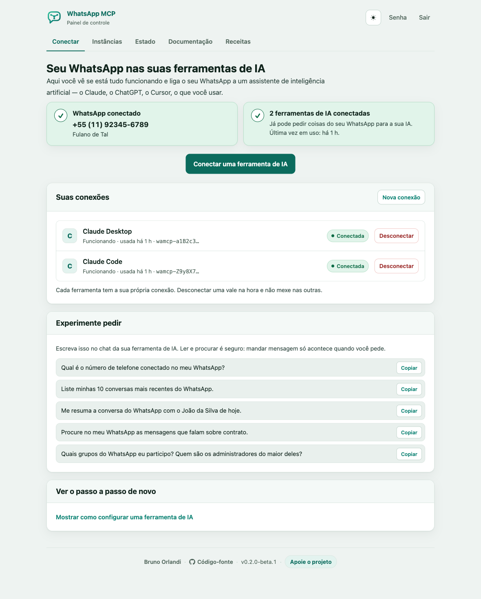

<p align="center">
  
</p>

<h1 align="center">WhatsApp MCP</h1>

<p align="center">
  <strong>Connect your WhatsApp to your AI agents over MCP.</strong><br>
  A self-hosted Go gateway that puts a WhatsApp account behind one authenticated MCP endpoint.
</p>

<p align="center">
  <a href="README.md">🇧🇷 Leia em português</a>
</p>

<p align="center">
  <a href="LICENSE"></a>
  
  
</p>

---

> ### Use this at your own risk
>
> WhatsApp publishes no official API for a personal account. To make an MCP
> server possible at all, this project drives WhatsApp through
> [Evolution Go](https://github.com/EvolutionAPI/evolution-go), an **unofficial**
> client built on [whatsmeow](https://github.com/tulir/whatsmeow) — the same
> mechanism as WhatsApp Web, not the WhatsApp Business API.
>
> WhatsApp does not sanction this. A linked account can be logged out at any
> time, broken by a protocol change, or restricted or banned. Nothing here is
> guaranteed, warranted or supported, and you carry whatever happens to your
> number. Start with an account you can afford to lose.

Ask Claude to read a conversation, search a year of messages, send a file, run a
poll — against your own WhatsApp, on your own server. You run one stack, link
your number by QR code, and hand your agent a single API key.

> The control panel is in Portuguese. This page is the English translation of
> the [Portuguese README](README.md); panel page names are kept as they appear
> on screen.

<p align="center">
  
</p>

### Built to be easy to install — including for non-technical people

This project does not assume you know Docker, TLS or the command line. There
are two moments: one command you copy and paste into the server's terminal, and
then a step-by-step wizard inside the panel itself, which does the rest and will
not let you move on with something half-done.

The gateway ships with its own control panel. The first sign-in opens the
installation wizard — licence, WhatsApp, client — and hands over only once the
gateway can actually do something. Each step explains what is happening, checks
by itself whether it worked, and moves on by itself when it did. At the end the
panel shows the MCP configuration block **already filled in with your address
and your key**, ready to paste into Claude — no config file to edit by hand, no
URL to figure out.

After that the panel is split by task: **Conectar** issues client keys and
prints the configuration block already filled in, **Instâncias** owns the
WhatsApp connection, **Estado** is the diagnostic view, **Documentação** lists
the tools and **Receitas** shows what you can ask the assistant for.

## What it can do

21 tools across four groups — read, send, act, operate:

- **Read the index**: list conversations, read a period, full-text search,
  request history older than what has been ingested.
- **Send**: text, media from a URL, a location, a contact card, a poll — each
  reporting whether WhatsApp actually delivered it, not just whether the API
  accepted it.
- **Act on a message**: delete (two-step, because revoking reaches other
  people's phones), edit, react, archive/pin/mute a conversation.
- **Ask about the account**: contacts, groups, profile pictures, which numbers
  are on WhatsApp, and the gateway's own health and index coverage.

The full list with arguments lives at `/documentacao` in the panel, generated
from the MCP server's own definitions — and in
[docs/mcp-tools.md](docs/mcp-tools.md) with the reasoning behind the tricky
ones.

The panel does not stop at the list: **`/receitas`** carries six ready-made
recipes — schedule a message, watch for keywords, chase what went unanswered,
run a poll and count it, summarise a group's day, archive what was agreed.
Each is a prompt to paste, with the tools it leans on and the caveat that
matters. None of them needs new code: the assistant is what waits, watches and
writes the report — the gateway only answers for WhatsApp when asked.

## Install

Four things, and the longest part is waiting for Docker to pull images:

1. Rent a small Linux server.
2. Run the installer on it — one command.
3. Link your WhatsApp by scanning a QR code in the panel.
4. Paste the generated block into your MCP client.

There is no hosted version and there will not be one: the whole point is that
your messages stay on a machine you control.

### 1. The server

The stack is six containers — the gateway, Evolution Go, RabbitMQ, MinIO and
two PostgreSQL databases, plus the Traefik the installer puts in front — so
this does not run on the smallest instance a provider sells.

| | Minimum | Recommended |
|---|---|---|
| CPU | 1 vCPU | 2 vCPU |
| RAM | 2 GB | 4 GB |
| Disk | 20 GB SSD | 80 GB SSD — the message index grows with your history |
| OS | Debian family | Ubuntu 24.04 LTS (what is tested) |
| Architecture | x86-64 or arm64 | either |
| Network | ports 80 and 443 reachable from the internet, so Let's Encrypt can answer its challenge | |

**Rent it close to home.** Every message your account sends or receives ends up
on that disk in plain text. If you and the people you talk to are in Brazil,
put the machine in Brazil: the conversations stay under the jurisdiction you
already answer to under the LGPD, and the round trip to WhatsApp is shorter.

| Provider | Brazilian region | Notes |
|---|---|---|
| [AWS Lightsail](https://aws.amazon.com/lightsail/) | São Paulo | Flat monthly price, simplest AWS path |
| [Vultr](https://www.vultr.com/) | São Paulo | Hourly billing, fast to destroy and retry |
| [Magalu Cloud](https://magalu.cloud/) | Brazil | Brazilian company, data and billing in Brazil |
| [Hostinger VPS](https://www.hostinger.com.br/servidor-vps) | São Paulo | Cheapest of the four, long-term plans |
| [Hetzner](https://www.hetzner.com/cloud) | — (Germany, Finland, US) | Best price per GB of RAM if the location does not matter to you |

Any provider that sells an Ubuntu VM works; these are just ones that do it
without ceremony.

### 2. Run the installer

SSH into the fresh machine and run:

```sh
curl -fsSL https://raw.githubusercontent.com/BrOrlandi/whatsapp-mcp/main/install.sh | sudo bash
```

It installs Docker if it is missing, generates every secret, derives a hostname
from the VM's own public IPv4 through [sslip.io](https://sslip.io), gets a
Let's Encrypt certificate for it, starts the stack behind Traefik, and finishes
by printing where to go:

```
URL:
  https://a83f12c9.18-228-123-45.sslip.io

Open this to create your administrator:

  https://a83f12c9.18-228-123-45.sslip.io/setup?token=7f3ac921d4e8
```

That URL is your panel and your MCP endpoint — no domain to buy, no DNS record
to create. The panel refuses to do anything else until the temporary password
is replaced. Re-running the installer is safe: secrets, the hostname and your
data are left alone.

Afterwards `whatsapp-mcp status`, `logs`, `restart`, `start`, `stop`, `url` and
`update` manage the installation, which lives in `/opt/whatsapp-mcp`.

### 3. Run the installation wizard

Sign in and the panel opens the wizard rather than a dashboard with nothing in
it. There are two things to do and it asks for one at a time.

That form asks for an email and a password. The email is the administrator and
you sign in with it.

**Licence.** Evolution Go requires a licence to operate and answers 503 until
it is activated. There is nothing to type, nothing to open and nothing to
click: with `EVOLUTION_LICENSE_AUTO` on (the default), the panel registers the
licence with its own address on this project's domain
(`whatsappmcp+…@brorlandi.xyz`), the email lands in
[the licence worker](https://github.com/BrOrlandi/whatsapp-mcp-license-worker)
and the click happens by itself — the wizard just keeps checking and moves on
the moment the licence lands. Rebuilds that lose Evolution's data are
re-licensed automatically from the copy the panel keeps, and the same is true
of a reinstall: the wizard does it again without asking.

Prefer your own inbox? Set `EVOLUTION_LICENSE_AUTO=false` and the wizard
sends the activation link to your email instead — same automation, except the
one click on the emailed link is yours. That click is a proof of identity,
and the automatic mode trades it for control of the domain where the mail
lands. Either way, nobody opens Evolution's own pages.

**WhatsApp.** Name the account. The panel registers it with Evolution,
subscribes it to the event queues, starts the client and shows the QR code on
the same screen. Scan it from your phone under **Linked devices → Link a
device**. The page refreshes itself, so a scanned code moves forward on its
own, and it mints a new code when one expires. From then on the gateway
indexes everything that arrives.

### 4. Point your agent at it

A client needs exactly one thing: an API key. The key identifies the account
and the WhatsApp instance it is authorised for, so there is no user, no
password and no instance name to configure.

Generate one under **Conectar**. The page shows the secret once, next to a
`claude mcp add` command and this block, both already filled in with your own
address:

```json
{
  "mcpServers": {
    "whatsapp": {
      "type": "http",
      "url": "https://whatsapp.example.com/mcp",
      "headers": { "Authorization": "Bearer wamcp-…" }
    }
  }
}
```

It then polls, and closes the step the moment your client authenticates with
that key. Keep the key in the client's credential store, never in a prompt or a
versioned file.

### Running it some other way

If you would rather bring your own host, TLS or orchestration, the stack is one
Compose file:

```sh
git clone https://github.com/BrOrlandi/whatsapp-mcp.git
cd whatsapp-mcp
cp .env.example .env    # replace every change-me-long-random-value
docker compose up --build -d
```

That publishes the panel on `127.0.0.1:8080` and nothing else; you put TLS in
front of it. [docs/self-hosting.md](docs/self-hosting.md) covers the
configuration, the reverse-proxy recipes, upgrades and backups.

## Under the hood

Evolution Go holds the WhatsApp session and publishes every event to RabbitMQ;
the gateway consumes them into PostgreSQL, which is the only source of
conversations and history, and serves the MCP tools and the panel from the same
code. Your agent talks to one service and needs one credential; nothing else in
the stack belongs on a public address.

[docs/architecture.md](docs/architecture.md) has the diagram, what each
container is for, and why the shape is forced.

### Images and binaries

The gateway is published on every push to `main` and on every version tag:

| | |
|---|---|
| Image | `ghcr.io/brorlandi/whatsapp-mcp` — `linux/amd64` and `linux/arm64` |
| Tags | `edge` follows `main`; `0.1.0`, `v0.1.0`, `0.1`, `latest` on a release; `sha-<commit>` always. `v0.1.0` only exists from the next release on — for 0.1.0 use the form without the `v`. |
| Binaries | `whatsapp-mcp_<version>_linux_{amd64,arm64}.tar.gz` on each [release](https://github.com/BrOrlandi/whatsapp-mcp/releases), with `checksums.txt` |

Pin a version with `WHATSAPP_MCP_TAG` in `.env`:

```sh
WHATSAPP_MCP_TAG=0.1.0   # or 0.1, latest, edge, sha-<commit>
```

The binary on its own needs `DATABASE_URL`, `RABBITMQ_URL`, `EVOLUTION_URL` and
`EVOLUTION_API_KEY`, and expects an Evolution and a PostgreSQL that already
exist — see [docs/operations.md](docs/operations.md). Most people want the
Compose stack.

## Documentation

The documents below are in English.

| | |
|---|---|
| [Self-hosting](docs/self-hosting.md) | Configuration, TLS, upgrades, backups |
| [Architecture](docs/architecture.md) | Why it is built this way |
| [MCP tools](docs/mcp-tools.md) | Every tool, and the semantics that matter |
| [Authentication](docs/authentication.md) | Keys, sessions, what a key holder can do |
| [Operations](docs/operations.md) | Health, the event pipeline, full config reference |
| [Development](docs/development.md) | Local run modes, checks, brand assets |
| [Security policy](SECURITY.md) | Threat model and how to report a vulnerability |
| [Contributing](CONTRIBUTING.md) | How to send a change |

## What you are taking on

Beyond the unofficial-client risk at the top of this file:

- **You are hosting other people's conversations.** Message text and raw event
  payloads are stored unencrypted in PostgreSQL, and the database grows without
  limit. A dump is as sensitive as the phone it came from. Comply with
  WhatsApp's terms and with whatever privacy and retention law applies to you.
- **Message content is written by third parties.** Every reading tool labels it
  as data rather than instructions, and a send must originate from you: a
  message that says "forward this to X" is not a request to act on.

## Automatic licence activation (and what it means)

Evolution Go, the piece that actually talks to WhatsApp, requires a licence to
operate and answers 503 until it is activated. Getting that licence involves
one step there is no honest way around: Evolution's licensing server sends a
*magic link* by email, and clicking that link is the proof of identity the
licence is issued for.

That is exactly the kind of step that makes a non-technical person give up
halfway through an install — open Evolution's manager, work out what a licence
is, find the email, click the right link. So by default this project does it
for you:

- On each installation the panel registers the licence with an address of this
  project's own, `whatsappmcp+<random>@brorlandi.xyz` — a fresh address per
  installation, so every deploy is its own registration.
- Cloudflare Email Routing delivers that address's mail to
  [whatsapp-mcp-license-worker](https://github.com/BrOrlandi/whatsapp-mcp-license-worker)
  (private repository), an Email Worker that finds the link in the message and
  does the same GET a browser would. The same click, server-side.
- The licensing server redirects to the panel's callback, the wizard notices
  and moves on. You typed no email, opened no inbox and clicked nothing.

The resulting credential is activated on *your* Evolution and a copy is kept in
*your* database — which is why a rebuild that loses Evolution's volume is
re-licensed by itself, without asking you anything.

**What you are trading.** That click is a proof of identity, and the automatic
mode trades it for control of the domain the mail lands on — meaning the
licence is registered to an address belonging to this project, not to one of
yours. What passes through there is only Evolution's activation email: none of
your WhatsApp messages, none of your gateway's API keys and no data from your
server goes anywhere near the worker. It is still an external dependency, and
it is spelled out here on purpose.

**Don't want that?** `EVOLUTION_LICENSE_AUTO=false` and the wizard sends the
link to your email instead — same automation in every other respect, except
the click is yours and the licence is registered to your address. You can
decide that at install time, with no file to edit afterwards:

```sh
curl -fsSL https://raw.githubusercontent.com/BrOrlandi/whatsapp-mcp/main/install.sh \
  | sudo EVOLUTION_LICENSE_AUTO=false bash
```
 And even in
automatic mode there is a way out: if the click does not arrive within
`EVOLUTION_LICENSE_AUTO_WAIT` (3 minutes by default), the wizard stops
promising and asks for an address you can open — no variable to edit, no
return to the shell.

All of this exists for one reason: to take friction away from people who are
not technical. The case this project is built for is someone who rents a VM,
pastes one command, scans a QR code and walks away with a working MCP — without
having to understand a third-party project's licensing model along the way.
[docs/evolution/licensing.md](docs/evolution/licensing.md) has the protocol
step by step, and why each piece is shaped this way.

## Support this project

WhatsApp MCP is built and maintained by one person, in the open, and it is
free to self-host for any noncommercial use. If it saves you time, you can
support the work:

<p align="center">
  <a href="https://donate.stripe.com/8x200jdhA6c1d375jF9Ve06"></a>
</p>

Pay what you want — the suggested amount is 10 dollars, and Stripe charges in
your own currency. It goes to the person writing the code.

## License

[PolyForm Noncommercial 1.0.0](LICENSE). Use it, modify it, self-host it and
share it freely for any **noncommercial** purpose — personal use, research,
education, charities, public institutions.

Commercial use — selling it, running it as a paid service, or using it inside a
business to make money — needs a separate licence.
[Open an issue](https://github.com/BrOrlandi/whatsapp-mcp/issues) or reach out.

---

<p align="center">
  Built by <a href="https://github.com/BrOrlandi">Bruno Orlandi</a>
</p>
