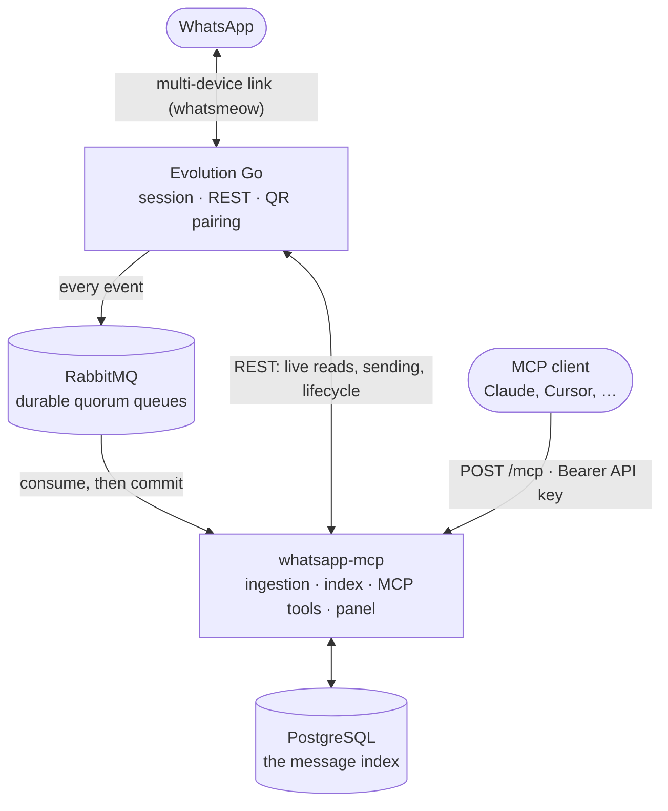

<p align="center">
  
</p>

<h1 align="center">WhatsApp MCP</h1>

<p align="center">
  <strong>Connect your WhatsApp to your AI agents over MCP.</strong><br>
  A self-hosted Go gateway that puts a WhatsApp account behind one authenticated MCP endpoint.
</p>

<p align="center">
  <a href="LICENSE"></a>
  
  
</p>

---

Ask Claude to read a conversation, search a year of messages, send a file, run a
poll — against your own WhatsApp, on your own server. Evolution Go, RabbitMQ and
PostgreSQL run behind it; the MCP client needs none of them.

A client needs exactly one thing: an API key. The key identifies the account and
the WhatsApp instance it is authorised for, so there is no user, no password and
no instance name to configure.

```json
{
  "mcpServers": {
    "whatsapp": {
      "type": "http",
      "url": "https://whatsapp.example.com/mcp",
      "headers": { "Authorization": "Bearer wamcp-…" }
    }
  }
}
```

Keys are issued and revoked in the control panel, which prints that block
already filled in. Keep the key in the client's credential store, never in a
prompt or a versioned file.

## What it can do

21 tools across four groups — read, send, act, operate:

- **Read the index**: list conversations, read a period, full-text search,
  request history older than what has been ingested.
- **Send**: text, media from a URL, a location, a contact card, a poll — each
  reporting whether WhatsApp actually delivered it, not just whether the API
  accepted it.
- **Act on a message**: delete (two-step, because revoking reaches other
  people's phones), edit, react, archive/pin/mute a conversation.
- **Ask about the account**: contacts, groups, profile pictures, which numbers
  are on WhatsApp, and the gateway's own health and index coverage.

The full list with arguments lives at `/documentacao` in the panel, read from
the MCP server's own definitions — and in [docs/mcp-tools.md](docs/mcp-tools.md)
with the reasoning behind the tricky ones.

## The control panel

The same HTTP server serves a Portuguese control panel, split by task:
**Conectar** hands a client everything it needs, **Instâncias** owns the
WhatsApp account lifecycle, **Estado** is the diagnostic view. Creating
something happens in a dialog, and destructive actions ask first.

<p align="center">
  
</p>

## Architecture



| Component | Role |
|---|---|
| **`whatsapp-mcp`** | This repository. The MCP endpoint, the control panel, the ingestion loop and the message index. The only service with a public address. |
| **[Evolution Go](https://github.com/EvolutionAPI/evolution-go)** | Holds the WhatsApp session through [whatsmeow](https://github.com/tulir/whatsmeow), answers live reads and sends, publishes every event. Apache-2.0 with brand-protection conditions; **requires activation** before it answers. |
| **RabbitMQ** | Carries events from Evolution to the gateway. Durable quorum queues, manual acknowledgements. |
| **PostgreSQL** ×2 | One holds the message index, the keys and the instance registry; the other is Evolution's own. |
| **MinIO** | Where Evolution stores media. |

The shape is forced by one fact: Evolution Go exposes no route to list
conversations or read message history. So PostgreSQL is the only source of
history, it covers exactly what has been ingested, and every reading tool
reports `history_since` rather than pretending otherwise.
[docs/architecture.md](docs/architecture.md) has the rest.

## Install

### One command, on a fresh VM

Create a Linux VM anywhere — Lightsail, Vultr, DigitalOcean, Hetzner — with
ports 80 and 443 open, then:

```sh
curl -fsSL https://raw.githubusercontent.com/BrOrlandi/whatsapp-mcp/main/install.sh | sudo bash
```

The installer puts Docker on the machine if it is missing, generates every
secret, derives a hostname from the VM's own public IPv4 through
[sslip.io](https://sslip.io), gets a Let’s Encrypt certificate for it, starts
the stack behind Traefik, and prints the URL and a temporary administrator
password:

```
URL:
  https://a83f12c9.18-228-123-45.sslip.io

Administrator:
  admin

Temporary password:
  XXXXXXXXXXXXXXXX
```

No domain to buy, no DNS record to create. The panel refuses to do anything
else until that temporary password is replaced, and re-running the installer
is safe: secrets, the hostname and your data are left alone.

Afterwards `whatsapp-mcp status`, `logs`, `restart` and `update` manage the
installation, which lives in `/opt/whatsapp-mcp`.

**Requirements:** Ubuntu 24.04 LTS (the Debian family works; 24.04 is what is
tested), x86-64 or arm64, ~2 GB of RAM, and 80/443 reachable from the internet
so Let’s Encrypt can answer its challenge.

### By hand, with Docker Compose

```sh
git clone https://github.com/BrOrlandi/whatsapp-mcp.git
cd whatsapp-mcp
cp .env.example .env
```

Replace every `change-me-long-random-value` in `.env` with a *distinct* random
value, and set `PUBLIC_URL` to the address clients will use. Then:

```sh
docker compose config        # fails loudly if .env is incomplete
docker compose up --build -d
curl http://127.0.0.1:8080/healthz
```

That publishes the panel on `127.0.0.1:8080` and nothing else. Put TLS in
front of it yourself, or use `deploy/docker-compose.public.yml` to get the
same Traefik the installer sets up.

### Either way

**Activate Evolution Go.** It requires a licence to operate and answers 503
until activated — follow the flow in the
[Evolution Go repository](https://github.com/EvolutionAPI/evolution-go).

**Open the panel.** The first sign-in sets your password. Create an instance,
scan the QR code from **Linked devices → Link a device**, then generate a key
in **Conectar** and paste the block it gives you into your MCP client.

[docs/self-hosting.md](docs/self-hosting.md) has the reverse-proxy recipes,
backups and upgrades.
## Documentation

| | |
|---|---|
| [Self-hosting](docs/self-hosting.md) | Configuration, TLS, upgrades, backups |
| [Architecture](docs/architecture.md) | Why it is built this way |
| [MCP tools](docs/mcp-tools.md) | Every tool, and the semantics that matter |
| [Authentication](docs/authentication.md) | Keys, sessions, what a key holder can do |
| [Operations](docs/operations.md) | Health, the event pipeline, full config reference |
| [Development](docs/development.md) | Local run modes, checks, brand assets |
| [Security policy](SECURITY.md) | Threat model and how to report a vulnerability |
| [Contributing](CONTRIBUTING.md) | How to send a change |

## Before you run this

Evolution Go is an **unofficial** WhatsApp integration. It may be logged out,
disrupted by protocol changes, or subject to account restrictions. Use a test
account first, and comply with WhatsApp's terms and with whatever privacy and
retention law applies to you — you are hosting other people's conversations.

Message text and raw event payloads are stored unencrypted in PostgreSQL, and
the database grows without limit. A dump is as sensitive as the phone it came
from.

Message content is written by third parties. Every reading tool labels it as
data rather than instructions, and a send must originate from you: a message
that says "forward this to X" is not a request to act on.

## Support this project

WhatsApp MCP is built and maintained by one person, in the open, and it is
free to self-host for any noncommercial use. If it saves you time, you can
support the work:

<p align="center">
  <a href="https://donate.stripe.com/8x200jdhA6c1d375jF9Ve06"></a>
</p>

Pay what you want — the suggested amount is 10 dollars, and Stripe charges in
your own currency. It goes to the person writing the code.
## License

[PolyForm Noncommercial 1.0.0](LICENSE). Use it, modify it, self-host it and
share it freely for any **noncommercial** purpose — personal use, research,
education, charities, public institutions.

Commercial use — selling it, running it as a paid service, or using it inside a
business to make money — needs a separate licence.
[Open an issue](https://github.com/BrOrlandi/whatsapp-mcp/issues) or reach out.

---

<p align="center">
  Built by <a href="https://github.com/BrOrlandi">Bruno Orlandi</a>
</p>
