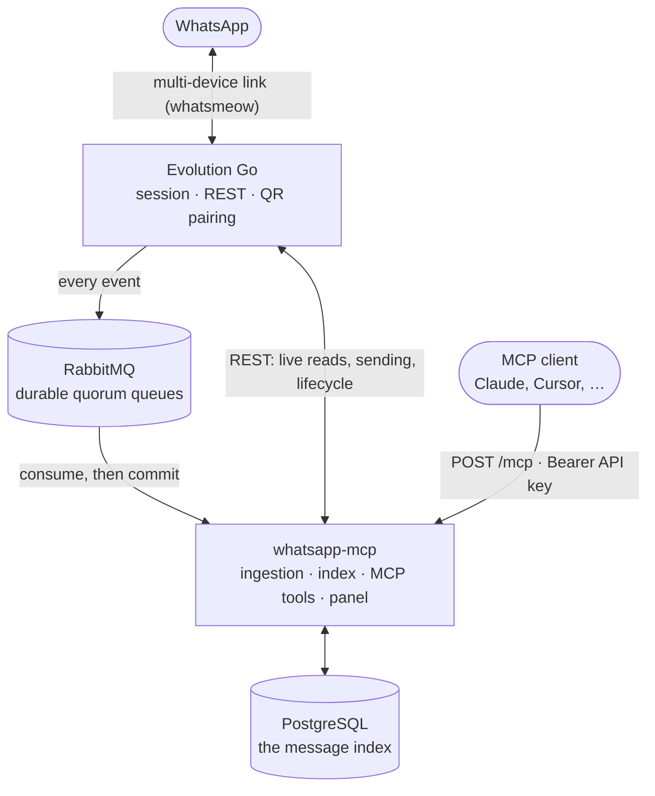

# Architecture

## The constraint that decides the shape

Evolution Go exposes no route to list conversations or read message history. The
`/chat/findChats` and `/chat/findMessages` routes of Evolution API v2 do not
exist in it. Everything below follows from that:

- **PostgreSQL is the only source of conversations and history.** Evolution
  publishes every event to RabbitMQ, this gateway consumes it and indexes it.
  The index covers exactly what has been ingested, which is why every reading
  tool reports `history_since`.
- **Evolution answers for everything live**: the address book, the groups,
  sending, and the instance lifecycle.
- **One service layer, two façades.** The MCP tools and the control panel share
  the same code; the tools call it directly rather than looping back through
  HTTP, so a failure is described identically wherever you read it.

## The pieces

| Component | Image | Role |
|---|---|---|
| `whatsapp-mcp` | built from this repository | The MCP endpoint, the control panel, the ingestion loop and the message index. The only service with a public address. |
| [Evolution Go](https://github.com/EvolutionAPI/evolution-go) | `evoapicloud/evolution-go` | Holds the WhatsApp session through [whatsmeow](https://github.com/tulir/whatsmeow), answers live reads and sends, and publishes every event. Apache-2.0 with brand-protection conditions, and it requires activation before it answers — see [self-hosting](self-hosting.md). |
| RabbitMQ | `rabbitmq:4.1-management` | Carries events from Evolution to the gateway. Durable quorum queues, manual acknowledgements. |
| PostgreSQL (gateway) | `postgres:17.6` | The message index, the API keys, the panel account, the instance registry. Migrations run automatically on start. |
| PostgreSQL (Evolution) | `postgres:17.6` | Evolution's own auth and user databases. The gateway never reads it. |
| MinIO | `minio` | Where Evolution stores media. The gateway asks Evolution for media rather than reaching into the bucket. |

An MCP client talks to exactly one of these — `whatsapp-mcp` — and needs exactly
one credential. Evolution Go has no public surface and its manager is never
needed after activation.

## Ingestion

Subscribing at connect time is what makes Evolution publish at all: its RabbitMQ
producer drops every event unless the connect call sets `rabbitmqEnable`. The
panel subscribes each instance to `MESSAGE`, `SEND_MESSAGE`, `HISTORY_SYNC` and
`CONNECTION` when it starts the client.

The gateway consumes every queue those subscriptions create — `message`,
`sendmessage`, `historysync` and the six connection queues — because a queue
Evolution declares and nobody reads grows without bound. Valid events are
acknowledged only after the PostgreSQL transaction commits. Duplicate deliveries
are harmless through event and message uniqueness constraints. Transient
database failures are explicitly requeued and retried after reconnect; malformed
JSON is rejected without requeue, to prevent a poison-message loop.

## Instance tokens

The panel mints a per-instance Evolution token, stores it in PostgreSQL and uses
it for every per-instance call, because Evolution resolves the target instance
from the key on the request and accepts no instance parameter. Only the
administrative routes (`/instance/create`, `/instance/all`,
`/instance/delete/{id}`) carry the global key.

That token is an internal secret: it is never displayed and never reaches an MCP
client. An instance created outside the panel has no token here, so the panel
marks it and refuses to operate it.

[`evolution/endpoint-map.md`](evolution/endpoint-map.md) maps every Evolution
route this project depends on, against the `swagger.yaml` versioned next to it.
