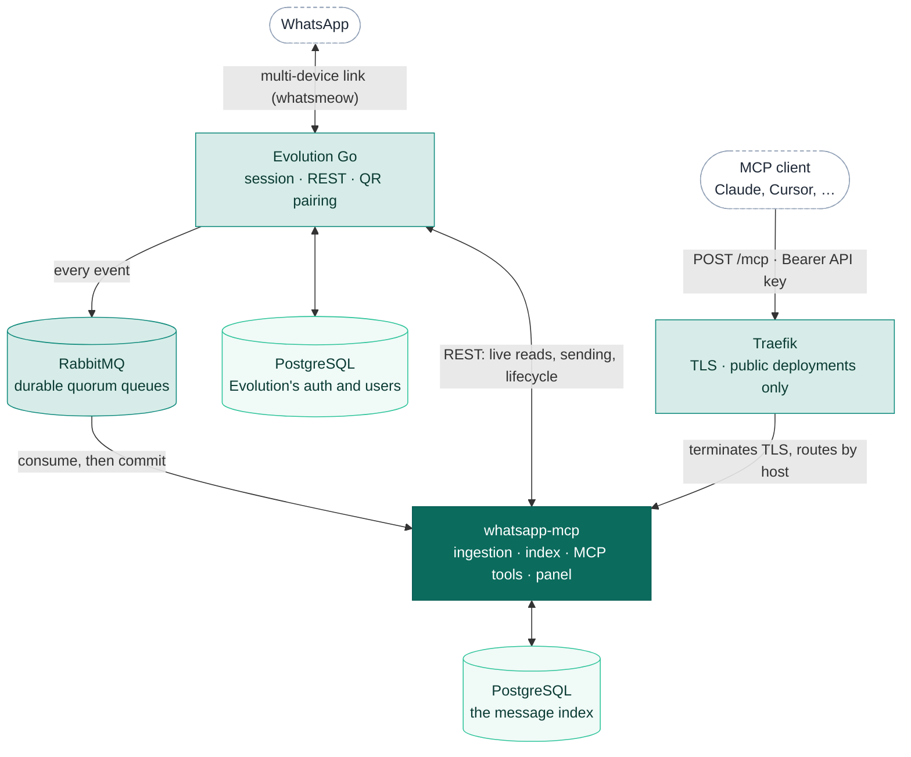

# Architecture

## The constraint that decides the shape

Evolution Go exposes no route to list conversations or read message history. The
`/chat/findChats` and `/chat/findMessages` routes of Evolution API v2 do not
exist in it. Everything below follows from that:

- **PostgreSQL is the only source of conversations and history.** Evolution
  publishes every event to RabbitMQ, this gateway consumes it and indexes it.
  The index covers exactly what has been ingested, which is why every reading
  tool reports `history_since`.
- **Evolution answers for everything live**: the address book, the groups,
  sending, and the instance lifecycle.
- **One service layer, two façades.** The MCP tools and the control panel share
  the same code; the tools call it directly rather than looping back through
  HTTP, so a failure is described identically wherever you read it.

## The pieces

```mermaid
flowchart TD
    WA(["WhatsApp"])
    EVO["Evolution Go<br/>session · REST · QR pairing"]
    MQ[("RabbitMQ<br/>durable quorum queues")]
    GW["whatsapp-mcp<br/>ingestion · index · MCP tools · panel"]
    DB[("PostgreSQL<br/>the message index")]
    EVODB[("PostgreSQL<br/>Evolution's auth and users")]
    PROXY["Traefik<br/>TLS · public deployments only"]
    CLIENT(["MCP client<br/>Claude, Cursor, …"])

    WA <-->|"multi-device link (whatsmeow)"| EVO
    EVO -->|"every event"| MQ
    MQ -->|"consume, then commit"| GW
    EVO <-->|"REST: live reads, sending, lifecycle"| GW
    EVO <--> EVODB
    GW <--> DB
    CLIENT -->|"POST /mcp · Bearer API key"| PROXY
    PROXY -->|"terminates TLS, routes by host"| GW

    %% Fill, stroke and text colour are all set explicitly, because GitHub
    %% renders this against a light or a dark page and only the values named
    %% here survive both.
    classDef repo fill:#0b6b5d,stroke:#075e54,color:#ffffff
    classDef service fill:#d7ece8,stroke:#128c7e,color:#0b3b34
    classDef store fill:#f0faf7,stroke:#2ec49a,color:#0b3b34
    classDef outside fill:#ffffff,stroke:#94a3b8,color:#1f2937,stroke-dasharray:4 3

    class GW repo
    class EVO,MQ,PROXY service
    class DB,EVODB store
    class WA,CLIENT outside
```

Filled dark is this repository. Pale teal is a dependency it runs alongside,
cylinders are the things that hold state, and the dashed nodes sit outside the
stack entirely.

| Component | Image | Role |
|---|---|---|
| `whatsapp-mcp` | built from this repository | The MCP endpoint, the control panel, the ingestion loop and the message index. The only service an MCP client addresses. |
| [Evolution Go](https://github.com/EvolutionAPI/evolution-go) | `evoapicloud/evolution-go` | Holds the WhatsApp session through [whatsmeow](https://github.com/tulir/whatsmeow), answers live reads and sends, and publishes every event. Apache-2.0 with brand-protection conditions, and it requires activation before it answers — see [self-hosting](self-hosting.md). |
| RabbitMQ | `rabbitmq:4.1-management` | Carries events from Evolution to the gateway. Durable quorum queues, manual acknowledgements. |
| PostgreSQL (gateway) | `postgres:17.6` | The message index, the API keys, the panel account, the instance registry. Migrations run automatically on start. |
| PostgreSQL (Evolution) | `postgres:17.6` | Evolution's own auth and user databases. The gateway never reads it. |
| Traefik | `traefik:v3.3.4` | Terminates TLS and obtains the Let's Encrypt certificate. The only container that binds a public port, and the only one added by [`deploy/docker-compose.public.yml`](../deploy/docker-compose.public.yml) — which `install.sh` always uses, and which the base file deliberately knows nothing about. Nothing is routed without an explicit label; the dashboard and the API are off. |

An MCP client talks to exactly one of these — `whatsapp-mcp` — and needs exactly
one credential. Evolution Go has no public surface and its manager is never
needed after activation.

## Ingestion

Subscribing at connect time is what makes Evolution publish at all: its RabbitMQ
producer drops every event unless the connect call sets `rabbitmqEnable`. The
panel subscribes each instance to `MESSAGE`, `SEND_MESSAGE`, `HISTORY_SYNC`,
`READ_RECEIPT` and `CONNECTION` when it starts the client; in global mode the
queues themselves follow `AMQP_GLOBAL_EVENTS` in the stack's compose file.

The gateway consumes every queue those subscriptions create — `message`,
`sendmessage`, `historysync`, `receipt` and the six connection queues — because
a queue Evolution declares and nobody reads grows without bound. Valid events are
acknowledged only after the PostgreSQL transaction commits. Duplicate deliveries
are harmless through event and message uniqueness constraints. Transient
database failures are explicitly requeued and retried after reconnect; malformed
JSON is rejected without requeue, to prevent a poison-message loop.

### What the index reads out of each event

Every message row carries, besides its text and media type, the message it
quotes, the people it mentions, whether it was forwarded, the message a
reaction is to, and the file name and format of its media. An edit or a
deletion for everyone is a protocol message: it changes the row it points at
(`edited`, `revoked`) instead of adding one. Rows written before decoder
version 3 are filled in from their stored events by the repair pass at
startup.

Receipts (`receipt` queue) are not kept as events — there is one per message
delivered and read — only their effect: a `read-self` receipt, the account
reading a chat on another device, moves that chat's `read_until` forward.
Together with the unread count a history sync gives for each conversation, the
account's own messages and what `mark_chat_read` and `organise_chat` record,
that is the `chat_state` table `list_chats`, `list_unread` and
`list_unanswered` read. Evolution Go 0.7.2 does not publish archive, pin or mute
changes (its `Archive` handler fails before publishing), so `CHAT_PRESENCE` is
not subscribed.

### Webhooks

After an event commits, the consumer hands it to the webhook manager, which
posts live messages, reactions and receipts to the operator's scripts: one
queue per webhook, in order, signed, retried, turned off after ten failures in
a minute. See [webhooks.md](webhooks.md).

## Media

Audio, video, images, documents and
stickers are fetched from WhatsApp when a tool asks for them:

1. **At ingestion** the gateway keeps the event exactly as Evolution published
   it, in the `events` table. For a media message that payload carries the
   protobuf message WhatsApp sent: the file's `directPath` on WhatsApp's media
   CDN, the `mediaKey` it is encrypted with, `fileEncSHA256`/`fileSHA256`, the
   mimetype and the length. It does not carry the file.
2. **On `download_media` or `transcribe_audio`** the gateway reads that payload
   back (`RawMessage`), extracts the message from it (`events.MessageContent`,
   which also finds it inside a history-sync conversation), and posts it to
   Evolution's `POST /message/downloadmedia`.
3. **Evolution, through whatsmeow**, downloads the encrypted file from the CDN,
   checks the hashes, decrypts it with the `mediaKey` and answers with the
   bytes as a data URI.
4. **The gateway keeps it and hands it on.** The file is written to the data
   volume (`MEDIA_DIR`, `/var/lib/whatsapp-mcp/data/media/<instance>/<chat>/`),
   and handed over inside the tool result (as an image, an audio or a file
   block), or, with `link: true` or over 20 MiB, behind a ten-minute token on
   `/media/<token>`. The next request for the same message is served from the
   kept copy, which is also what keeps a file readable after WhatsApp
   discards it. `media_stats`, `purge_media` and the panel's **Arquivos
   baixados** card measure and clear the folder; an optional retention deletes
   files older than a number of days. `export_messages` writes to
   `EXPORT_DIR` on the same volume.

When the gateway hands a file to Evolution — a forwarded photo, a sticker sent
again from a `download_media` link — Evolution fetches it from
`INTERNAL_URL/media/<token>`, the gateway's address inside the stack.

A transcript is the one derivative that is kept, in PostgreSQL, so a voice note
is transcribed once.

**WhatsApp discards media.** Some time after a file is sent, the CDN answers
404. Evolution wraps that in a 500; the gateway names it `ErrMediaExpired`, the
tools say the file is gone and that only the sender resending it brings it
back, and a media link answers 410. The retention is WhatsApp's and is not
documented; in one real run, voice notes sent in August were already gone by
late September. Asking the sender's phone to re-upload (whatsmeow's media retry receipt)
is not something Evolution exposes, so it is not attempted.

### Keeping media, if that is ever wanted

Until v0.4.0-beta.1 the stack ran a MinIO that never received a file:
`MINIO_ENABLED` was on, but Evolution writes media to its store only when
`WEBHOOK_FILES` is true, which the stack never set, and nothing created the
bucket. It was removed when `quay.io/minio/minio` started answering 401 — MinIO
archived its community edition and serves neither images nor binaries any more
(dl.min.io answers 410).

Keeping a copy of every file past WhatsApp's retention would take three things:

- **An object store.** Evolution's `MINIO_*` variables speak plain S3 through
  minio-go: `MINIO_ENDPOINT`, `MINIO_ACCESS_KEY`, `MINIO_SECRET_KEY`,
  `MINIO_BUCKET`, `MINIO_USE_SSL` and `MINIO_REGION`. On a host outside AWS
  that means a MinIO container again, from a maintained community build such
  as `pgsty/minio` (amd64 and arm64, same data format, `curl` inside for the
  healthcheck), pinned by digest. On AWS it can be an S3 bucket in the
  instance's region; S3 Standard is about US$ 0.023 per GB-month. Either way
  the bucket has to be created by the installer, and it should carry a
  lifecycle rule that expires objects (a year is a reasonable default), since
  nothing else ever deletes them.
- **`WEBHOOK_FILES=true`** on Evolution, so it downloads every incoming file
  and stores it at `evolution-go-medias/<message id><ext>`. Without an object
  store it inlines the file as base64 in the RabbitMQ event instead, which
  would bloat the queue and the `events` table.
- **A fallback in the gateway**, reading the stored object when the CDN
  answers 404. It does not exist: today the gateway never reads Evolution's
  store.

Evolution also tries to set a public-read policy on the bucket at startup. On a
MinIO that only the Compose network reaches that is harmless; on S3, Block
Public Access refuses it, Evolution logs a warning and carries on, and the
access key should not be granted `s3:PutBucketPolicy` in the first place.

## Instance tokens

The panel mints a per-instance Evolution token, stores it in PostgreSQL and uses
it for every per-instance call, because Evolution resolves the target instance
from the key on the request and accepts no instance parameter. Only the
administrative routes (`/instance/create`, `/instance/all`,
`/instance/delete/{id}`) carry the global key.

That token is an internal secret: it is never displayed and never reaches an MCP
client. An instance created outside the panel has no token here, so the panel
marks it and refuses to operate it.

[`evolution/endpoint-map.md`](evolution/endpoint-map.md) maps every Evolution
route this project depends on, against the `swagger.yaml` versioned next to it.
